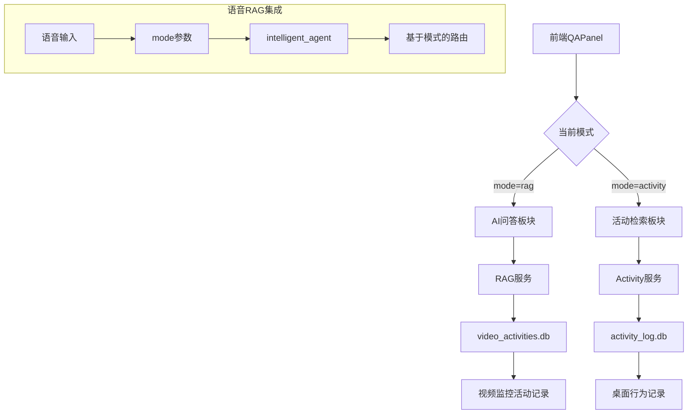

# QA板块特定数据库路由系统

## 🎯 **功能概述**

根据您的需求，我们实现了QA面板的两个板块区分功能，让不同的板块查询不同的数据库：

### 📋 **板块划分**

| 板块 | 功能 | 数据库 | 数据类型 |
|------|------|--------|----------|
| 🤖 **AI问答** | 回答MCP和监控视频的活动记录 | `video_activities.db` | 视频监控数据 |
| 🖥️ **活动检索** | 回答桌面行为记录 | `activity_log.db` | 桌面行为数据 |

## 🏗️ **实现架构**

### 数据流向图


## 🔧 **技术实现**

### 1. 前端修改 (`QAPanel.vue`)
- ✅ 已有`currentMode`切换：`'rag'` / `'activity'`
- ✅ 语音请求添加模式参数：`mode: currentMode.value`
- ✅ 不同板块显示不同的占位符文本

### 2. 语音RAG服务 (`voice_rag_service_fixed.py`)
```python
# 新增模式参数
class VoiceRequest(BaseModel):
    audio_data: str
    format: str = "wav"
    mode: str = "rag"  # 新增: 'rag' 或 'activity'

# 更新处理逻辑
async def process_query(self, text: str, mode: str = "rag"):
    # 传递模式给intelligent_agent
    result = await self.intelligent_agent.process_user_request(text, mode=mode)
```

### 3. 智能代理 (`intelligent_agent.py`)
```python
async def process_user_request(self, user_query: str, mode: str = "rag"):
    # 根据模式调整系统提示和处理逻辑

async def _handle_api_failure(self, user_query: str, error_message: str, mode: str = "rag"):
    if mode == "activity":
        # 优先处理桌面活动关键词
        activity_keywords = ["访问", "浏览", "网站", "应用", "软件", ...]
    elif mode == "rag":
        # 优先处理视频监控关键词
        video_keywords = ["看手机", "玩手机", "睡觉", "喝水", ...]
```

### 4. RAG服务器 (`rag_server_v2.py`)
```python
class ChatRequest(BaseModel):
    query: str
    mode: Optional[str] = "rag"  # 新增模式参数

@app.post("/detect_intent/")
async def detect_intent(request: ChatRequest):
    mode = getattr(request, 'mode', 'rag')

    if mode == "rag":
        # 查询video_activities.db
        # 视频监控活动检索
    elif mode == "activity":
        # 转发到桌面活动服务
        # 查询activity_log.db
```

## 📝 **查询示例**

### 🤖 AI问答板块 (`mode=rag`)
**查询视频监控数据 (`video_activities.db`)**

| 用户输入 | 预期数据源 | 示例回复 |
|----------|------------|----------|
| "我什么时候看手机了？" | 视频监控记录 | "根据监控记录，您今天14:30-15:20看了手机，共50分钟" |
| "昨天我几点睡觉的？" | 视频监控记录 | "监控显示您昨晚23:15开始准备睡觉" |
| "我今天喝水了吗？" | 视频监控记录 | "监控记录显示您今天10:30和15:45有饮水行为" |

### 🖥️ 活动检索板块 (`mode=activity`)
**查询桌面行为数据 (`activity_log.db`)**

| 用户输入 | 预期数据源 | 示例回复 |
|----------|------------|----------|
| "我今天访问了哪些网站？" | 桌面活动记录 | "您今天访问了：GitHub、Stack Overflow、ChatGPT..." |
| "昨天我用了什么软件？" | 桌面活动记录 | "您昨天主要使用了：VSCode、Chrome、WeChat..." |
| "我浏览了哪些页面？" | 桌面活动记录 | "浏览记录：技术文档、新闻网站、在线教程..." |

## 🧪 **测试验证**

### 运行测试
```bash
# 1. 启动所有服务
python rag_server_v2.py        # 端口8085
python activity_ui.py          # 端口5001
python voice_rag_service_fixed.py  # 端口8087

# 2. 运行测试脚本
python test_board_routing.py
```

### 测试覆盖
- ✅ 服务健康检查
- ✅ AI问答模式查询路由
- ✅ 活动检索模式查询路由
- ✅ 模式特定关键词识别
- ✅ 语音集成测试

## 🎉 **功能特性**

### ✅ 已实现的功能

1. **板块区分**：前端明确区分AI问答和活动检索
2. **模式传递**：前端当前模式传递到所有后端服务
3. **智能路由**：根据模式自动选择合适的数据库
4. **关键词识别**：不同模式下优先识别相关关键词
5. **服务集成**：语音RAG服务完整支持模式切换
6. **回退机制**：如果智能代理失败，按模式回退到相应服务

### 🎯 **用户体验**

- **AI问答板块**：询问"我什么时候看手机了" → 查询视频监控数据
- **活动检索板块**：询问"我访问了哪些网站" → 查询桌面行为数据
- **语音交互**：语音按钮自动根据当前板块查询对应数据库
- **智能识别**：系统自动识别查询类型并路由到正确数据源

## 🔮 **扩展性**

该架构支持未来扩展：
- 添加新的数据源（如邮件、日历等）
- 新增板块模式
- 集成更多MCP工具
- 支持多数据源聚合查询

---

**现在您的QA系统已经能够根据板块自动选择合适的数据库！** 🎯✨