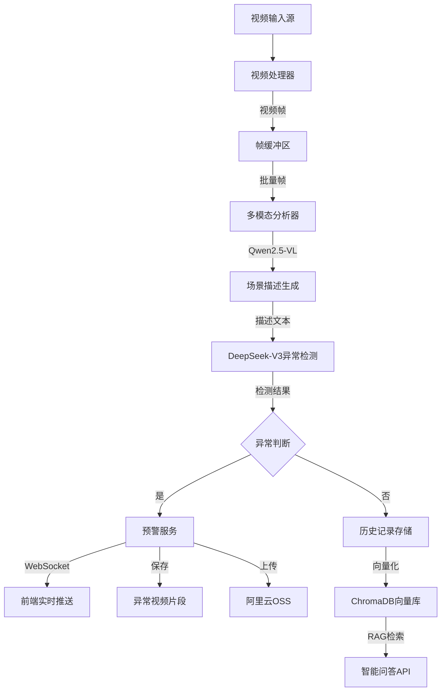
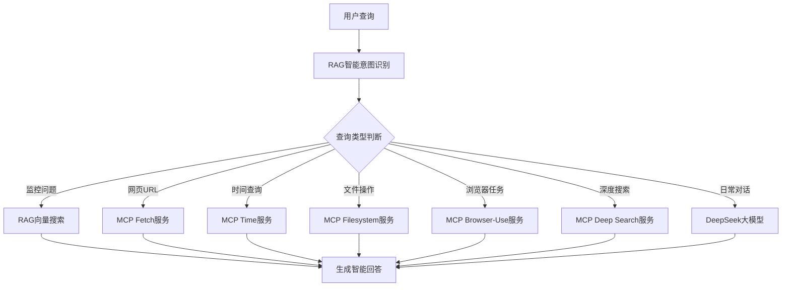

[English](readme_en.md) | 中文

# 智能AI监控与活动助手

## 项目概述

本项目是一个功能强大的、基于多模态AI和微服务架构的**一体化智能监控与个人活动助手系统**。它不仅仅是一个视频监控工具，更是一个深度集成的AI应用平台，融合了**实时视频分析**、**个人桌面活动追踪**、**智能问答**、**语音交互**以及通过MCP协议驱动的**一系列高级AI智能体**功能。

系统致力于提供全方位的态势感知，既能保障物理空间的安全，也能作为个人数字化生活的得力助手，帮助用户回顾和分析自己的桌面活动，并通过自然语言进行高效的信息检索和设备控制。

## 🚀 主要特性

### 核心功能
- 🎥 **实时视频分析**：支持摄像头、RTSP流和本地视频文件，集成先进的多模态分析模型进行场景理解和异常检测。
- 🖥️ **桌面活动追溯**：在后台静默记录屏幕内容、应用使用情况和鼠标交互，形成个人活动日志。
- 💬 **双模态智能问答**：
    - **AI智能体模式**：基于RAG和MCP协议，回答通用问题、分析网页、控制浏览器、执行深度搜索等。
    - **桌面活动助手模式**：通过自然语言查询个人桌面活动，例如"我昨天下午在用什么软件？"或"过去一小时我浏览了哪些关于Python的网页？"。
- 🗣️ **语音交互助手**：支持实时的语音识别（ASR）和文本转语音（TTS），允许用户通过语音与AI进行对话。
- 📊 **活动数据可视化**：提供交互式的关键词云和应用使用时长统计图表，直观展示用户活动模式。
- ⚠️ **可定制异常预警**：基于自定义规则的场景化异常识别，并通过WebSocket进行实时推送。

### MCP智能助手功能
- 🌐 **网页内容提取**：自动获取和分析网页内容
- 🕒 **时间查询服务**：智能时间和日期查询
- 📁 **文件系统管理**：桌面文件和目录浏览
- 🤖 **浏览器自动化**：自动化网页操作和数据提取
- 🔍 **深度网络搜索**：多轮搜索和资料调研
- 🧠 **智能意图识别**：自动识别用户请求类型并调用相应服务

### 技术特色
- 📱 **现代化前端**：Vue.js 3 + Vite构建的响应式Web界面
- 🔧 **微服务架构**：独立的视频处理、RAG服务、MCP服务和前端服务
- 📊 **向量数据库**：ChromaDB存储和检索历史分析数据
- 🔄 **实时通信**：WebSocket双向通信支持
- 🎛️ **灵活配置**：完整的配置管理和命令行参数支持
- 🔌 **MCP协议集成**：标准化的服务间通信协议

## 📋 系统架构

### 服务组件
下图展示了系统的微服务架构，各个组件通过网络进行通信，协同工作。

```mermaid
graph TD
    subgraph "用户端"
        A[Vue.js 前端<br/>Port: 3000/5173]
    end

    subgraph "核心后端服务"
        B[视频服务<br/>video_server.py<br/>Port: 16532]
        C[RAG & MCP服务<br/>rag_server.py<br/>Port: 8085]
        D[桌面活动服务<br/>activity_ui.py<br/>Port: 5001]
        E[语音处理服务<br/>backend_app.py<br/>Port: 5000]
    end

    subgraph "MCP协议栈"
        F[MCPO 路由中心<br/>Port: 8000]
        G[MCP Tools<br/>(Filesystem, Browser, etc.)]
    end
    
    subgraph "数据存储"
        H[ChromaDB 向量库<br/>(视频 & 活动)]
        I[SQLite 数据库<br/>activity_log.db]
    end

    A -- "视频流/预警" --> B
    A -- "AI智能体/RAG查询" --> C
    A -- "桌面活动查询/可视化" --> D
    A -- "语音识别/合成" --> E
    
    C -- "调用MCP工具" --> F
    F -- "路由" --> G
    
    B -- "存储视频分析" --> H
    C -- "存储/检索" --> H
    D -- "存储/检索活动" --> H
    D -- "读取原始活动" --> I
    
```

### 数据流程


### MCP服务架构


## 🛠️ 技术栈

### 后端技术
- **框架**：FastAPI + Uvicorn
- **视频处理**：OpenCV
- **协议标准**：MCP (Model Context Protocol)
- **AI模型**：
  - Qwen2.5-VL-32B-Instruct（多模态视觉分析）
  - DeepSeek-V3（文本生成和异常检测）
  - SenseVoice（语音识别和关键词检测）
- **向量数据库**：ChromaDB
- **云存储**：阿里云OSS
- **实时通信**：WebSocket

### 前端技术
- **框架**：Vue.js 3 + Composition API
- **构建工具**：Vite
- **UI组件**：
  - Chart.js（数据可视化）
  - ECharts（图表展示）
  - FontAwesome（图标库）
- **功能库**：
  - RecordRTC（音频录制）
  - Axios（HTTP请求）
  - Marked（Markdown渲染）

### 开发工具
- **语言**：Python 3.8+、JavaScript ES6+
- **包管理**：pip、npm、uvx
- **代码规范**：支持热重载开发

### MCP服务组件
- **MCPO**：MCP协议服务器和路由中心
- **Fetch服务**：网页内容获取和解析
- **Time服务**：时间查询和日期处理
- **Filesystem服务**：文件系统访问和管理
- **Browser-Use服务**：浏览器自动化和网页操作
- **Deep Search服务**：深度网络搜索和资料调研

## 📦 安装部署

### 环境要求
- Python 3.8+
- Node.js 16+
- uv 包管理器（用于MCP服务）
- 支持摄像头的设备（可选）

### 1. 克隆项目
```bash
git clone <repository-url>
cd AI_Watch_Dog
```

### 2. 安装uv包管理器（MCP服务依赖）
```bash
# Windows
curl -LsSf https://astral.sh/uv/install.ps1 | powershell

# macOS/Linux
curl -LsSf https://astral.sh/uv/install.sh | sh
```

### 3. 后端环境配置
```bash
# 安装Python依赖
pip install -r requirements.txt

# 配置API密钥
# 编辑 config.py 文件，配置以下参数：
# - QWEN_API_KEY: Qwen模型API密钥
# - DEEPSEEK_API_KEY: DeepSeek模型API密钥
# - OSS相关配置（如需云存储）

# 配置MCP服务
# 编辑 mcp.json 文件，根据需要调整MCP服务配置
```

### 4. 前端环境配置
```bash
cd frontend
npm install
npm run build
cd ..
```

### 5. 启动MCPO服务（必须）
```bash
# 方法1：使用uvx启动（推荐）
uvx mcpo --config mcp.json --port 8000

# 方法2：使用python启动
python -m mcpo --config mcp.json --port 8000

# 确保MCPO服务在8000端口正常运行
# 访问 http://localhost:8000/docs 查看MCP服务文档
```

### 6. 一键启动所有服务
```bash
# 使用一键启动脚本（推荐）
# 该脚本会尝试启动所有后端服务
python start_all_services.py

# 或手动启动各服务（推荐用于调试）：
# 1. 启动MCPO服务（必须先启动）
uvx mcpo --config mcp.json --port 8000

# 2. 启动RAG & MCP服务
python rag_server.py

# 3. 启动视频监控服务
# python video_server.py --video_source 0  # 使用摄像头
python video_server.py --video_source "./测试视频/sample.mp4"

# 4. 启动桌面活动服务
python activity_ui.py

# 5. 启动语音处理服务
python backend/backend_app.py

# 6. 启动前端开发服务
cd frontend && npm run dev
```

## 🎯 使用说明

### 访问地址
- **主界面 (Vue)**：http://localhost:5173 (开发模式) 或 http://localhost:3000
- **视频监控API**：http://localhost:16532/docs
- **RAG/MCP服务API**：http://localhost:8085/docs
- **桌面活动服务API**：http://localhost:5001
- **语音处理服务API**：http://localhost:5000
- **MCPO服务API**：http://localhost:8000/docs

### WebSocket接口
- **实时预警推送**：`ws://localhost:16532/alerts`
- **视频流推送**：`ws://localhost:16532/video_feed`

### API接口

#### 视频监控相关
- **获取预警列表**：`GET /api/alerts`
- **测试预警功能**：`GET /test_alert`
- **行为分析数据**：`GET /api/behavior-data`

#### RAG和智能助手
- **智能意图识别**：`POST http://localhost:8085/detect_intent/`
- **RAG搜索**：`POST http://localhost:8085/search/`
- **添加文档**：`POST http://localhost:8085/add_text/`

#### MCP服务（通过RAG服务调用）
- **网页内容提取**：`POST http://localhost:8085/extract_webpage/`
- **时间查询**：`POST http://localhost:8085/get_time/`
- **文件列表**：`POST http://localhost:8085/list_files/`
- **浏览器自动化**：`POST http://localhost:8085/run_browser_agent/`
- **深度搜索**：`POST http://localhost:8085/run_deep_search/`

### 配置自定义提示词
编辑 `prompt.py` 文件中的提示词模板，适配不同监控场景：
```python
# 根据实际场景修改异常检测提示词
ANOMALY_DETECTION_PROMPT = """
分析监控场景，重点关注：
1. 可疑人员行为
2. 物品异常摆放
3. 环境安全状况
...
"""
```

### 智能助手功能使用

#### 1. 监控查询
```bash
# 支持的查询类型
"今天监控到什么？"
"几点有人进入房间？"
"显示异常行为记录"
"什么时候检测到活动？"
```

#### 2. 网页内容分析
```bash
# 直接提供URL
"分析这个网页 https://example.com"
"获取 https://news.example.com 的内容"
```

#### 3. 浏览器自动化
```bash
# 浏览器任务
"打开百度搜索人工智能"
"访问GitHub并查找Python项目"
"浏览淘宝并搜索笔记本电脑"
```

#### 4. 深度搜索调研
```bash
# 研究任务
"深度搜索人工智能的最新发展"
"研究区块链技术的应用场景"
"调研新能源汽车市场趋势"
```

#### 5. 文件和时间查询
```bash
# 时间查询
"现在几点了？"
"今天是什么日期？"

# 文件查询
"桌面上有什么文件？"
"显示文件列表"
```

### MCP服务配置
编辑 `mcp.json` 文件配置MCP服务：
```json
{
  "mcpServers": {
    "fetch": {
      "command": "uvx",
      "args": ["mcp-server-fetch"]
    },
    "browser-use": {
      "command": "uv",
      "args": ["--directory", "path/to/mcp-browser-use", "run", "src/mcp_server_browser_use/server.py"],
      "env": {
        "MCP_API_KEY": "your-api-key",
        "MCP_MODEL_PROVIDER": "deepseek",
        "MCP_HEADLESS": "false"
      }
    }
  }
}
```

## 📁 项目结构

```
AI_Watch_Dog/
├── backend/                  # Python后端服务
│   └── backend_app.py        # 语音处理服务 (ASR/TTS)
├── frontend/                 # Vue.js前端应用
│   ├── src/                  # 前端源码
│   └── ...
├── mcp_tools/                # MCP工具集 (地图, 搜索等)
├── screen_recordings/        # 屏幕活动日志和截图
│   └── activity_log.db       # SQLite数据库
├── video_warning/            # 异常视频存储目录
├── video_chroma_db/          # ChromaDB视频向量数据库
├── chroma_db_activity/       # ChromaDB活动向量数据库
├── activity_retriever.py     # 桌面活动检索与索引逻辑
├── activity_ui.py            # 桌面活动服务后端
├── config.py                 # 系统配置文件
├── llm_service.py            # 大语言模型服务
├── mcp.json                  # MCP服务器配置文件
├── rag_server.py             # RAG知识库与MCP总线服务
├── screen_capture.py         # 屏幕活动记录器
├── start_all_services.py     # 一键启动脚本
├── video_server.py           # 视频监控主服务
└── README.md                 # 项目说明文档
```

## 🔧 功能模块详解

### 视频分析模块
- **多源输入**：摄像头、RTSP流、本地文件
- **智能缓冲**：滑窗分析机制，可配置分析间隔
- **异常检测**：基于AI模型的实时异常识别
- **视频分段**：自动保存异常时段的视频片段

### 语音处理模块
- **实时语音识别**：SenseVoice模型支持
- **关键词监控**：可配置关键词检测和预警
- **语音转文本**：支持多语言语音识别

### RAG与活动知识库
- **双重知识库**：系统维护两个独立的向量数据库：一个用于**视频监控分析结果**，另一个用于**个人桌面活动记录**。
- **历史记录存储**：所有分析结果和活动日志都被向量化并存储在对应的ChromaDB集合中。
- **智能检索**：根据查询意图，从正确的知识库中进行语义相似度搜索。
- **统一问答入口**：通过`rag_server`的意图识别，将用户问题路由到视频RAG、活动RAG或通用LLM。

### 桌面活动助手模块
- **静默后台记录**：`screen_capture.py` 脚本负责在后台运行，捕捉屏幕截图、窗口信息、应用名称和鼠标点击。
- **结构化存储**：所有活动数据被结构化地存入 `screen_recordings/activity_log.db` SQLite数据库。
- **按需索引**：`activity_retriever.py` 负责从SQLite加载新数据，并将其高效地索引到ChromaDB中，以供语义搜索。
- **数据可视化API**：`activity_ui.py` 提供API，用于生成关键词云和应用使用统计。

### MCP智能助手模块
- **网页提取服务**：
  - 自动获取网页内容
  - 智能提取关键信息
  - 支持动态页面解析

- **浏览器自动化**：
  - 自动化网页操作
  - 智能表单填写
  - 数据提取和截图
  - 支持可视化和无头模式

- **文件系统管理**：
  - 目录浏览和文件列表
  - 文件信息查询
  - 跨平台路径支持

- **深度搜索功能**：
  - 多轮搜索策略
  - 信息整合和分析
  - 资料调研报告生成

### 预警系统
- **多级预警**：支持不同严重级别的预警分类
- **实时推送**：WebSocket实时推送到所有连接客户端
- **历史记录**：完整的预警历史和统计分析

## 📊 输出文件说明

### 自动生成文件
- `video_warning/`：异常视频片段存储
- `video_history_info.txt`：视频内容分析历史
- `code.log`：系统运行日志
- `video_chroma_db/`：视频向量数据库
- `chroma_db_activity/`：活动向量数据库

### 云存储（可选）
- 异常视频自动上传阿里云OSS
- 支持配置自定义存储路径和策略

## ⚙️ 高级配置

### 模型配置
系统支持多种AI服务提供商：
- **Chutes.ai**（默认）
- **OpenRouter**
- **阿里云DashScope**
- **SiliconFlow**

### MCP服务配置
- **服务端口**：默认8000端口
- **服务超时**：可配置请求超时时间
- **环境变量**：支持API密钥等环境变量配置
- **日志级别**：可调节MCP服务日志详细程度

### 性能优化
- **并发处理**：多线程视频处理和分析
- **内存管理**：智能缓冲区管理和垃圾回收
- **网络优化**：WebSocket连接池和断线重连
- **MCP缓存**：智能缓存MCP服务响应

### 安全配置
- **API密钥管理**：支持环境变量和配置文件
- **访问控制**：可配置服务绑定地址和端口
- **数据加密**：支持HTTPS和WSS安全连接
- **MCP权限**：限制MCP服务访问范围

## 🐛 故障排除

### 常见问题
1. **摄像头无法访问**：检查摄像头权限和索引配置
2. **API调用失败**：验证API密钥和网络连接
3. **前端无法连接**：确认后端服务已正常启动
4. **向量数据库错误**：检查ChromaDB目录权限
5. **MCPO服务启动失败**：
   - 检查uv包管理器是否安装
   - 验证mcp.json配置文件
   - 确认端口8000未被占用
6. **MCP服务调用超时**：
   - 检查网络连接
   - 调整服务超时配置
   - 验证MCP服务状态

### 调试工具
- 系统日志：查看 `code.log` 文件
- 测试接口：访问 `/test_alert` 测试预警功能
- API文档：访问 `/docs` 查看完整API文档
- MCP服务状态：访问 `http://localhost:8000/docs` 查看MCP服务
- 智能助手测试：使用 `/detect_intent/` 端点测试意图识别

### MCP服务调试
```bash
# 检查MCPO服务状态
curl http://localhost:8000/health

# 测试特定MCP服务
curl -X POST http://localhost:8000/time/get_current_time

# 查看MCP服务日志
# 在启动MCPO时会显示各服务的状态
```

## 🤝 贡献指南

欢迎提交Issue和Pull Request来改进项目！

### 开发环境
```bash
# 开发模式启动前端
cd frontend && npm run dev

# 开发模式启动后端（支持热重载）
python video_server.py --reload

# 开发模式启动MCPO服务
uvx mcpo --config mcp.json --port 8000 --reload
```

### 添加新的MCP服务
1. 在 `mcp.json` 中添加新服务配置
2. 在 `rag_server.py` 中添加对应的API端点
3. 更新意图识别逻辑
4. 添加相应的测试用例

## 📄 开源协议

本项目采用 MIT 开源协议，详见 LICENSE 文件。

## 🙏 致谢

感谢以下开源项目和服务提供商：
- **AI模型**：Qwen2.5-VL、DeepSeek-V3、SenseVoice
- **框架技术**：FastAPI、Vue.js、ChromaDB
- **MCP协议**：Model Context Protocol标准
- **MCP服务**：mcp-server-fetch、mcp-server-time、mcp-server-filesystem
- **浏览器自动化**：Browser-Use项目
- **包管理器**：uv包管理器