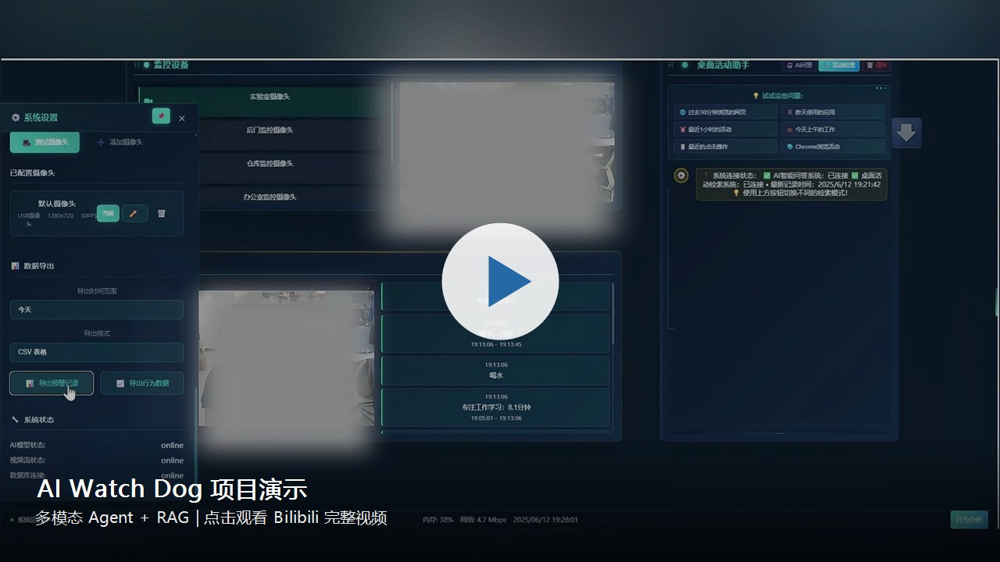
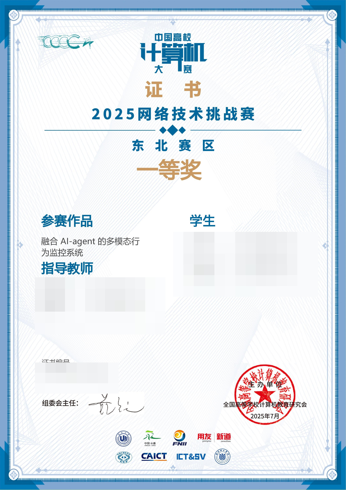
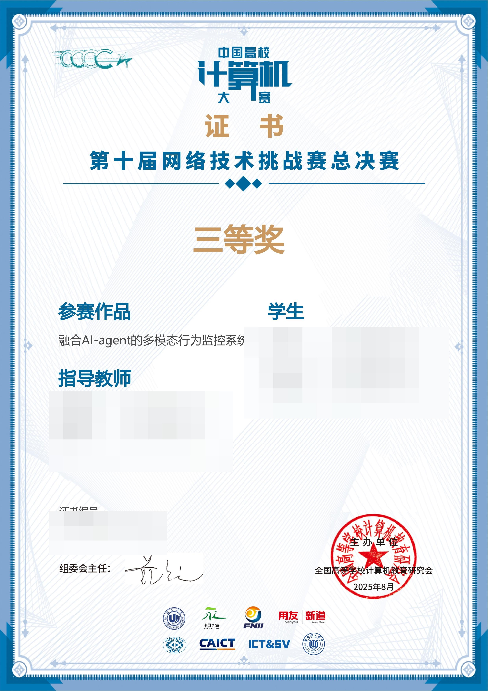
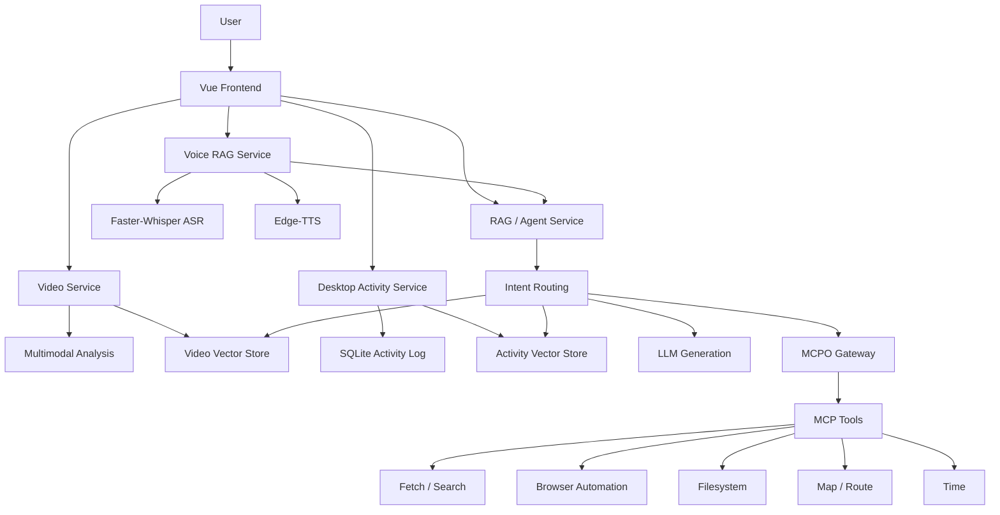
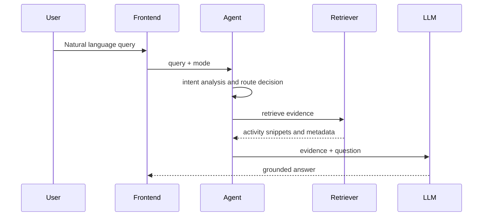

# AI Watch Dog

面向个人活动日志的多模态 Agent 与 RAG 检索系统。系统可以采集视频画面、桌面操作、屏幕 OCR、窗口标题、浏览 URL、应用使用时长和语音输入，并通过自然语言完成历史行为检索、活动总结、工具调用和语音问答。

演示视频：

<p align="center">
  <a href="https://www.bilibili.com/video/BV187EE6JEy5/">
    
  </a>
</p>

GitHub 地址：[https://github.com/li-longjie/AI_Watch_Dog](https://github.com/li-longjie/AI_Watch_Dog)

竞赛成果：本作品参加中国高校计算机大赛网络技术挑战赛，获得东北赛区一等奖、全国三等奖。

获奖证书（已对个人姓名、学校和证书编号等信息做隐私处理）：

<p align="center">
  
  
</p>

## 项目背景

传统的视频监控或桌面记录系统通常只能保存原始数据，用户后续想要回看某个行为、某段网页内容、某次应用使用记录时，往往需要手动翻找视频、截图或日志。AI Watch Dog 的目标是把这些分散的多源活动数据统一建模成一个可检索、可统计、可追溯的个人活动知识库，让用户可以直接用自然语言提问。

示例问题：

- 我刚刚看过哪些网页？
- 今天下午主要使用了哪些应用？
- 过去一小时的视频里发生了什么？
- 我刚才打开过哪个文件夹？
- 帮我抓取这个网页并总结内容。
- 现在几点，顺便帮我打开浏览器搜索相关资料。

系统不只做数据记录，还会根据用户意图自动选择视频 RAG、桌面活动检索、通用大模型问答或 MCP 工具调用。

## 核心能力

### 多模态活动采集

- 视频监控：支持摄像头、本地视频和 RTSP 视频流输入，基于多模态模型生成场景描述与行为记录。
- 桌面活动：记录当前应用、窗口标题、页面标题、URL、鼠标点击、屏幕 OCR 文本和应用使用时长。
- 语音输入：支持前端录音、语音转写、文本查询、答案播报和唤醒词触发。
- 结构化日志：使用 SQLite 保存原始活动记录，并将重要文本内容向量化后写入向量数据库。

### 自然语言检索

- 视频检索：查询视频分析结果、行为记录和异常片段。
- 桌面检索：查询历史网页、应用使用、屏幕文字和窗口上下文。
- 时间理解：支持“刚刚”“今天下午”“昨天”“过去一小时”等时间表达。
- 结果生成：将检索到的证据组织成自然语言回答，并保留时间、应用、URL 等上下文。

### Agent 工具调用

- 自研轻量级 Agent 编排：包含快速路由、LLM 意图分析、本地回退和异常降级。
- MCP 工具接入：通过 MCPO 将 MCP Server 统一暴露为 HTTP 工具接口。
- 工具注册表：将网页抓取、时间查询、文件系统、浏览器自动化、搜索、地图、顺序推理等能力封装为标准 Tool。
- 动态选择工具：Agent 根据用户问题判断是走 RAG 检索、通用回答，还是调用外部工具。

### 语音交互

- Faster-Whisper：基于 CTranslate2 的高性能语音转写，支持 CPU/GPU 和 int8/float16 量化。
- TTS 播报：使用 Edge-TTS 将回答转换为语音。
- 唤醒词：前端基于 Web Speech API 实现简易唤醒词监听，默认唤醒词为“你好助手”。
- 分阶段响应：支持先展示转写文本，再生成 RAG/Agent 回答和语音播报。

## 系统架构


```mermaid
flowchart TD
    U["User"] --> FE["Vue Frontend"]

    FE --> VIDEO["Video Service"]
    FE --> RAG["RAG / Agent Service"]
    FE --> ACT["Desktop Activity Service"]
    FE --> VOICE["Voice RAG Service"]

    VIDEO --> VLM["Multimodal Analysis"]
    VIDEO --> VDB["Video Vector Store"]

    ACT --> SQLITE["SQLite Activity Log"]
    ACT --> ADB["Activity Vector Store"]

    VOICE --> ASR["Faster-Whisper ASR"]
    VOICE --> TTS["Edge-TTS"]
    VOICE --> RAG

    RAG --> ROUTER["Intent Routing"]
    ROUTER --> VDB
    ROUTER --> ADB
    ROUTER --> LLM["LLM Generation"]
    ROUTER --> MCPO["MCPO Gateway"]

    MCPO --> MCP["MCP Tools"]
    MCP --> WEB["Fetch / Search"]
    MCP --> BROWSER["Browser Automation"]
    MCP --> FS["Filesystem"]
    MCP --> MAP["Map / Route"]
    MCP --> TIME["Time"]
```

## 关键技术实现

### 1. 多源数据建模

系统将视频分析、屏幕 OCR、窗口标题、URL、应用名称、点击事件和时间戳统一为活动记录。原始数据写入 SQLite，便于精确追溯；文本字段经过 embedding 后写入 ChromaDB，便于自然语言召回。

这种设计保留了两类能力：

- 精确查询：按时间、应用、URL、事件类型过滤。
- 语义查询：按自然语言描述召回相似活动片段。

当前开源版本默认使用 ChromaDB 作为向量数据库，检索层可替换为 Qdrant、Milvus 等向量检索组件。

### 2. RAG 检索链路

系统在查询时先进行意图识别，再选择对应数据源：

- 视频相关问题路由到视频活动向量库。
- 桌面操作、网页访问、应用使用问题路由到桌面活动服务。
- 实时信息、文件、网页、地图等问题路由到 MCP 工具。
- 普通对话或总结类问题交给 LLM 生成。

典型流程：


```mermaid
sequenceDiagram
    participant User
    participant Frontend
    participant Agent
    participant Retriever
    participant LLM

    User->>Frontend: Natural language query
    Frontend->>Agent: query + mode
    Agent->>Agent: intent analysis and route decision
    Agent->>Retriever: retrieve evidence
    Retriever-->>Agent: activity snippets and metadata
    Agent->>LLM: evidence + question
    LLM-->>Frontend: grounded answer
```

### 3. Agent 编排

Agent 编排不是简单的关键词匹配，而是由多个模块协同完成：

- ForceRouteAgent：对高置信度请求做快速路由，降低响应延迟。
- LLMAnalysisAgent：让大模型判断是否需要工具、使用哪个工具、传入哪些参数。
- LocalFallbackAgent：当 LLM 或 MCP 服务不可用时，提供本地规则回退。
- ToolRegistry：统一维护工具描述、函数 schema、参数解析和执行入口。

这种结构让系统可以在“准确性、响应速度、可用性”之间取得平衡：简单问题快速返回，复杂问题交给 LLM 和工具链，失败时仍能降级到基础检索。

### 4. MCP / MCPO 工具体系

项目通过 MCPO 将多个 MCP Server 转换为可被后端调用的 HTTP 工具服务。`mcp.json` 中配置工具来源，`mcp_tools/` 中封装统一的 Python Tool 接口。

已接入的工具包括：

- Fetch：网页内容抓取。
- Time：时间和日期查询。
- Filesystem：本地文件系统访问。
- Browser-Use：浏览器自动化任务。
- Chrome Tool：当前浏览器标签页、页面内容、截图和历史记录相关操作。
- DuckDuckGo Search：联网搜索。
- Baidu Map：地点搜索、路线规划和出行信息。
- Sequential Thinking：复杂任务的步骤化推理。

### 5. 语音问答链路

语音链路拆分为四步：

1. 前端录音或唤醒词触发。
2. 后端使用 Faster-Whisper 将音频转写为文本。
3. 文本交给 Agent/RAG 服务完成检索、工具调用或回答生成。
4. 使用 Edge-TTS 生成语音文件并返回前端播放。

前端的 `WakeWordManager` 基于浏览器 Web Speech API 常驻监听唤醒词，识别到唤醒词后触发语音输入流程。如果浏览器不支持 Web Speech API，会自动降级为手动触发。

## 技术栈

后端：

- Python
- FastAPI / Uvicorn
- SQLite
- ChromaDB
- LangChain 相关向量检索组件
- OpenCV
- Faster-Whisper / OpenAI Whisper fallback
- Edge-TTS
- MCP / MCPO

前端：

- Vue 3
- Vite
- Axios
- Chart.js / ECharts
- RecordRTC
- Web Speech API
- Marked / DOMPurify

模型与服务：

- Qwen-VL 多模态分析
- DeepSeek / SiliconFlow 兼容接口
- Sentence Transformers embedding
- Browser-Use
- MCP Server Fetch / Time / Filesystem / Sequential Thinking / DuckDuckGo / Baidu Map

## 目录结构

```text
AI_Watch_Dog/
├── activity_retriever.py          # 桌面活动检索与向量索引
├── activity_ui.py                 # 桌面活动服务与统计接口
├── config.py                      # 统一配置入口，API Key 从环境变量读取
├── intelligent_agent.py           # Agent 编排、工具选择和回退逻辑
├── llm_service.py                 # LLM 调用封装
├── mcp.json                       # MCP Server 配置
├── mcp_tools/                     # MCP 工具封装与注册表
├── multi_modal_analyzer.py         # 多模态视频分析
├── rag_server.py                  # RAG 服务兼容入口
├── rag_server_v2.py               # RAG + Agent 主服务入口
├── screen_capture.py              # 屏幕活动采集
├── video_server.py                # 视频监控服务
├── voice_rag_service_faster.py    # Faster-Whisper 语音 RAG 服务
├── requirements.txt               # 后端基础依赖
├── requirements_faster_whisper.txt# 语音服务依赖
├── frontend/                      # Vue 前端
└── .env.example                   # 环境变量模板
```

## 快速开始

### 1. 克隆项目

```bash
git clone https://github.com/li-longjie/AI_Watch_Dog.git
cd AI_Watch_Dog
```

### 2. 配置环境变量

复制 `.env.example` 并填写自己的密钥：

```bash
cp .env.example .env
```

主要变量：

```text
SILICONFLOW_API_KEY=
DASHSCOPE_API_KEY=
OPENROUTER_API_KEY=
MCP_API_KEY=
BAIDU_MAP_API_KEY=
OSS_ACCESS_KEY_ID=
OSS_ACCESS_KEY_SECRET=
OSS_BUCKET=
```

不要将 `.env` 提交到 Git 仓库。

### 3. 安装后端依赖

```bash
pip install -r requirements.txt

# 如需语音能力
pip install -r requirements_faster_whisper.txt
```

### 4. 安装前端依赖

```bash
cd frontend
npm install
npm run build
cd ..
```

### 5. 启动 MCPO

```bash
uvx mcpo --config mcp.json --port 8000
```

启动后可访问：

```text
http://localhost:8000/docs
```

### 6. 启动核心服务

推荐按需启动：

```bash
# RAG + Agent 服务
python rag_server_v2.py

# 桌面活动服务
python activity_ui.py

# 屏幕活动采集
python screen_capture.py

# 视频监控服务
python video_server.py

# Faster-Whisper 语音服务
python voice_rag_service_faster.py

# 前端开发服务
cd frontend && npm run dev
```

默认访问地址：

```text
Frontend:          http://localhost:5173
RAG / Agent:       http://localhost:8085/docs
Desktop Activity:  http://localhost:5001
Voice RAG:         http://localhost:8087/api/health
MCPO:              http://localhost:8000/docs
```

## 典型使用方式

视频与活动检索：

```text
今天监控里发生了什么？
刚才有没有人在画面里活动？
我昨天打开过哪些网页？
过去一小时主要用了哪些应用？
我刚才看过的页面里有没有某个关键词？
```

Agent 工具调用：

```text
现在几点？
帮我抓取这个网页并总结内容：https://example.com
查看桌面上有哪些文件。
打开浏览器搜索多模态 RAG 最新进展。
帮我规划从 A 到 B 的路线。
```

语音交互：

```text
说出“你好助手”触发前端唤醒词监听。
前端录音后，系统会自动转写、检索、生成答案并播报。
```

## API 示例

RAG / Agent 聊天：

```bash
curl -X POST http://localhost:8085/chat/ \
  -H "Content-Type: application/json" \
  -d "{\"query\":\"我刚才浏览了哪些网页？\",\"mode\":\"activity\"}"
```

语音转写：

```bash
curl -X POST http://localhost:8087/api/voice/transcribe \
  -H "Content-Type: application/json" \
  -d "{\"audio_data\":\"<base64-audio>\",\"format\":\"webm\"}"
```

语音问答：

```bash
curl -X POST http://localhost:8087/api/query/process \
  -H "Content-Type: application/json" \
  -d "{\"text\":\"今天下午我主要做了什么？\",\"mode\":\"activity\"}"
```

## 安全与隐私说明

本项目会涉及屏幕截图、窗口标题、URL、语音、视频和本地文件等个人数据。请只在本人授权、本地可信环境或研究演示环境中使用。

建议：

- 使用 `.env` 管理 API Key，不要在代码中写入真实密钥。
- 不要提交 `screen_recordings/`、`video_warning/`、`voice_rag_output/`、`chroma_db/` 等本地数据目录。
- 如需公开部署，应增加身份认证、访问控制、数据脱敏和日志清理机制。
- 当前项目主要面向本地化演示和学习研究，不建议直接暴露到公网。

## 项目亮点

- 将视频行为、桌面活动、OCR、URL、应用使用、语音输入统一到一个自然语言查询入口。
- 自研 Agent 编排层，将意图识别、检索路由、工具选择、工具执行、回退处理拆分为独立模块。
- 通过 MCPO 接入 MCP 工具生态，使系统具备浏览器自动化、网页抓取、文件访问、地图和搜索能力。
- 使用 SQLite + ChromaDB 兼顾原始日志追溯和语义检索。
- 使用 Faster-Whisper + Edge-TTS 构建低延迟语音问答链路。
- 具备完整的前后端工程化实现和可演示系统，而不是单一算法脚本。

## 后续优化方向

- 将向量检索层替换为 Qdrant，支持 dense vector、sparse vector 与 metadata filter 的混合检索。
- 引入更标准的 rerank 流程，提高长时间跨度活动检索的相关性。
- 增加权限控制和本地加密存储，提升隐私数据安全性。
- 对 Agent 工具调用链路增加可视化 trace，便于调试和展示。
- 将桌面活动与视频活动统一为事件图谱，支持更复杂的时序关系查询。

## 致谢

本项目使用或参考了以下开源生态：

- FastAPI
- Vue 3 / Vite
- ChromaDB
- LangChain
- Faster-Whisper
- Edge-TTS
- Model Context Protocol
- MCPO
- Browser-Use
- Qwen / DeepSeek 相关模型服务

## 说明

当前仓库主要用于个人作品展示、学习交流和本地化研究演示。如需正式开源或二次分发，建议补充明确的 LICENSE 文件。
